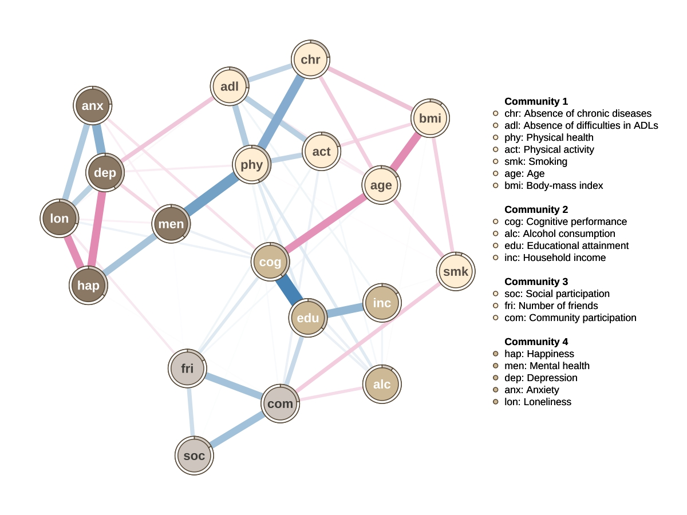

# Materials

<div style="text-indent: 1.5em;">
The materials used in this report are available online through this [link](https://github.com/awbanghao/networks), which includes the National Social Life, and Ageing Project (NSHAP) dataset, the accompanying codebook, loaded objects, and knitted results.
</div>

# Submission

## 1. Bridging resilience factors and dimensions of successful ageing: A network analysis 

<div style="text-indent: 1.5em;">
Population ageing is a defining demographic shift of the 21st century. By 2050, over 2.1 billion people will be aged 60 or older (Lin et al., 2020). Older age is accompanied by age-related challenges, such as chronic disease and cognitive decline (Waddell et al., 2024), and life changes such as spousal loss and reduced social networks that threaten well-being (Luo et al., 2012).

Promoting favourable health trajectories to mitigate age-related decline is now a public health priority. Successful ageing (SA), as defined by Rowe and Kahn (1987), encompasses the absence of chronic disease, independence in daily activities, high cognitive and physical function, and continued social participation. However, these outcomes vary considerably between individuals (Thoma et al., 2021), raising the question of why some individuals maintain well-being while others experience substantial decline.

Resilience is the capacity to maintain, recover, and adapt to adversity (Merchant et al., 2022), and is increasingly recognised as key to understanding heterogeneous ageing outcomes. Resilience-promoting factors such as physical activity correlate with reduced disability and cognitive impairment (Vitor et al., 2023), while resilience-reducing factors such as loneliness often undermine quality of life (Huisman et al., 2017). However, resilience is often treated as a single composite index (Hu, Zhang, & Wang, 2015), obscuring meaningful differences between specific resilience factors (Jacob et al., 2025).

This study addressed this research gap by examining how resilience factors form a network with successful ageing dimensions. It aimed to identify communities in the cross-domain network (RQ1), and which resilience factors act as key bridging nodes between resilience factors and successful ageing outcomes, providing insight into potential intervention targets in successful ageing.
</div>

## 2. Methods
### 2.1 Participants

<div style="text-indent: 1.5em;">
Data were from 3,196 community-dwelling adults from Wave 2 of the National Social Life, Health, and Aging Project (NSHAP), a population-based study of ageing in the United States (Suzman, 2009).
</div>

### 2.2 Data
#### 2.2.1 Variables

<div style="text-indent: 1.5em;">
Successful ageing dimensions (Rowe & Kahn, 1987) included chronic disease burden, difficulties with activities of daily living, physical health, cognitive function, and social participation. Resilience factors (Brinkhof et al., 2025; Koivunen et al., 2025) included physical activity, body mass index, alcohol consumption, smoking status, number of friends, community participation, loneliness, depression, anxiety, happiness, mental health, and education. Demographic variables included age and income.
</div>

#### 2.2.2 Preprocessing

<div style="text-indent: 1.5em;">
Analyses were conducted in R (Version 4.5.1). Missing values (4.4%) were imputed via random forest imputation with _missRanger_ (Mayer & Mayer, 2019). Skip-listed items were recoded to prevent dependencies induced by questionnaire routing (Burger et al., 2023).
</div>

### 2.3 Network

#### 2.3.1 Network estimation

<div style="text-indent: 1.5em;">
An undirected, weighted network was estimated using _bootnet_ (Epskamp, Borsboom, & Fried, 2018). Edges represented partial Spearman correlations to accommodate skewness and ordinal data. Given the large sample size (N = 3,196) relative to the number of nodes (N = 19), assumptions of network sparsity may not hold (Epskamp, Rhemtulla, & Borsboom, 2017). Thus, a model selection procedure, _ggmModSelect()_, was applied to prioritise edge specificity (Isvoranu & Epskamp, 2023).
</div>

#### 2.3.2 Network visualisation

<div style="text-indent: 1.5em;">
The network was visualised using _qgraph_ (Epskamp et al., 2012). Nodewise predictability was estimated in _mgm_ (Haslbeck & Waldorp, 2018) and represented the proportion of variance in each node explained by its neighbours in the network.
</div>

### 2.4 Analysis

#### 2.4.1 Bridge centrality

<div style="text-indent: 1.5em;">
Bridge expected influence (BEI) was computed in _networktools_ (Jones, 2017) and represented the signed sum of a node's edge weights connected to nodes outside its community. Nodes above the 80th percentile were identified as influential bridges (Jones, Ma & McNally, 2021). BEI values were examined between predefined resilience and successful ageing communities.
</div>

#### 2.4.2 Community detection

<div style="text-indent: 1.5em;">
Community structures were identified using _walktrap_, _spinglass_, _Louvain_, and _fastgreedy_ algorithms within _igraph_ (Csardi et al., 2006), with partitions evaluated by modularity (Q).
</div>

#### 2.4.3 Stability and accuracy

<div style="text-indent: 1.5em;">
Edge weight stability was assessed via nonparametric bootstrapping (N = 1000) in _bootnet._ Bridge centrality stability was estimated using case-dropping bootstraps and summarised with the correlation stability (CS) coefficient. Bootstrapped difference tests compared edge weights and centrality measures between nodes.
</div>

## 3. Results

### 3.1 Network description

<div style="text-indent: 1.5em;">
The estimated network is displayed in Figure 1, and comprised 19 nodes and 67 non-zero edges (out of 171 possible), indicating moderate connectivity (39.2% of possible edges were present). Edge-weight stability was excellent (CS = 0.75), indicating that the estimated network structure was robust to sampling variation. Nodewise predictability is displayed as node rings.
</div>

<center>

<center>

### 3.2 How do successful ageing dimensions and resilience factors cluster into network communities?

<div style="text-indent: 1.5em;">
The _walktrap_ and _Louvain_ algorithms yielded identical community partitions with the highest modularity (Q = 0.36). The communities were interpretable as: the physical and functional capacity community (N = 7), cognitive and socioeconomic community (N = 4), relational health community (N = 3), and emotional well-being community.
</div>

### 3.3 Which resilience factors act as the most influential bridges linking resilience-related factors to successful ageing outcomes in general?

<div style="text-indent: 1.5em;">
Bridge expected influence (BEI) estimates were excellent (CS = 0.75). Bootstrapped difference tests revealed that mental health (BEI = 0.443), educational attainment (BEI = 0.436) and physical activity (BEI = 0.339) formed the strongest bridges between the resilience and successful ageing community.
</div>

## 4. Discussion

<div style="text-indent: 1.5em;">
This study examined how resilience-promoting and resilience-reducing factors contribute to successful ageing through distinct pathways. Community detection algorithms revealed multiple cross-domain communities. This suggests that resilience may influence ageing outcomes through distinct pathways rather than as a unified construct (Hu, Zhang, & Wang, 2015). Prior research indicates that this clustering may reflect discrete age-related challenges, such as cognitive decline, multimorbidity, or social isolation (Jacob et al., 2025).

Bridge expected influence (BEI) analyses identified several resilience-related nodes most strongly connected to successful ageing: mental health, education, and physical activity. Mental health bidirectionally relates to multiple ageing outcomes (Ohrenberger, Fichera, & Sutton, 2017) by supporting healthcare engagement and self-care. Educational attainment may reflect cognitive reserve and lifelong cognitive enrichment (Stern et al., 2023), which may buffer cognition against age-related neurobiological changes. Physical activity correlates with functional performance and healthy ageing (Weening-Dijksterhuis et al., 2011). Together, these resilience factors may be promising intervention targets for the general promotion of successful ageing.
</div>

## 5. References

<div style="text-indent: -2em; padding-left: 2em;">
Brinkhof, L. P., Ridderinkhof, K. R., de Wit, S., Krugers, H. J., & Murre, J. M. J. (2025). A cross-sectional network analysis of successful aging in a resilience-based framework. PLoS One, 20(1), e0315445. <https://doi.org/10.1371/journal.pone.0315445>

Burger, J., Isvoranu, A. M., Lunansky, G., Haslbeck, J. M. B., Epskamp, S., Hoekstra, R. H. A., Fried, E. I., Borsboom, D., & Blanken, T. F. (2023). Reporting standards for psychological network analyses in cross-sectional data. Psychol Methods, 28(4), 806-824. <https://doi.org/10.1037/met0000471> 

Csárdi, G., Nepusz, T., Traag, V., Horvát, S., Zanini, F., Noom, D., Müller, K., Schoch, D., & Salmon, M. (2006). igraph: Network Analysis and Visualization. <https://doi.org/10.32614/CRAN.package.igraph> 

Epskamp, S., Borsboom, D., & Fried, E. I. (2018). Estimating psychological networks and their accuracy: A tutorial paper. Behav Res Methods, 50(1), 195-212. <https://doi.org/10.3758/s13428-017-0862-1> 

Epskamp, S., Cramer, A. O. J., Waldorp, L. J., Schmittmann, V. D., & Borsboom, D. (2012). qgraph: Network Visualizations of Relationships in Psychometric Data. Journal of Statistical Software, 48(4). <https://doi.org/10.18637/jss.v048.i04> 

Epskamp, S., Rhemtulla, M., & Borsboom, D. (2017). Generalized Network Psychometrics: Combining Network and Latent Variable Models. Psychometrika, 82(4), 904-927. <https://doi.org/10.1007/s11336-017-9557-x> 

Haslbeck, J. M. B., & Waldorp, L. J. (2018). How well do network models predict observations? On the importance of predictability in network models. Behav Res Methods, 50(2), 853-861. <https://doi.org/10.3758/s13428-017-0910-x> 

Hu, T., Zhang, D., & Wang, J. (2015). A meta-analysis of the trait resilience and mental health. Personality and Individual Differences, 76, 18-27. <https://doi.org/10.1016/j.paid.2014.11.039> 

Huisman, M., Klokgieters, S. S., & Beekman, A. T. F. (2017). Successful ageing, depression and resilience research; a call for a priori approaches to investigations of resilience. Epidemiol Psychiatr Sci, 26(6), 574-578. <https://doi.org/10.1017/S2045796017000348> 

Isvoranu, A. M., & Epskamp, S. (2023). Which estimation method to choose in network psychometrics? Deriving guidelines for applied researchers. Psychol Methods, 28(4), 925-946. <https://doi.org/10.1037/met0000439> 

Jacob, B. A., Walker, C., O'Sullivan, M., Rouse, P., & Parsons, M. (2025). A Multidimensional Perspective on Resilience in Later Life: A Systematic Literature Review of Protective Factors and Adaptive Processes in Ageing. Geriatrics (Basel), 10(6). <https://doi.org/10.3390/geriatrics10060154> 

Jones, P. (2017). networktools: Tools for Identifying Important Nodes in Networks. <https://doi.org/10.32614/CRAN.package.networktools> 

Jones, P. J., Ma, R., & McNally, R. J. (2021). Bridge Centrality: A Network Approach to Understanding Comorbidity. Multivariate Behav Res, 56(2), 353-367. <https://doi.org/10.1080/00273171.2019.1614898> 

Koivunen, K., Palmberg, L., Lunansky, G., Kok, A., Glynn, N. W., & Cooper, R. (2025). The interplay between perceived fatigability, intrinsic capacity, and physical activity: network analysis in a British birth cohort study. J Gerontol A Biol Sci Med Sci, 80(10). <https://doi.org/10.1093/gerona/glaf192> 

Lin, Y. H., Chen, Y. C., Tseng, Y. C., Tsai, S. T., & Tseng, Y. H. (2020). Physical activity and successful aging among middle-aged and older adults: a systematic review and meta-analysis of cohort studies. Aging (Albany NY), 12(9), 7704-7716. <https://doi.org/10.18632/aging.103057> 

Mayer, M., & Mayer, M. M. (2019). Package ‘missRanger’. R package, 820. 

Merchant, R. A., Aprahamian, I., Woo, J., Vellas, B., & Morley, J. E. (2022). Editorial: Resilience And Successful Aging. J Nutr Health Aging, 26(7), 652-656. <https://doi.org/10.1007/s12603-022-1818-4> 

Ohrnberger, J., Fichera, E., & Sutton, M. (2017). The relationship between physical and mental health: A mediation analysis. Soc Sci Med, 195, 42-49. <https://doi.org/10.1016/j.socscimed.2017.11.008> 

Rowe, J. W., & Kahn, R. L. (2015). Successful Aging 2.0: Conceptual Expansions for the 21st Century. J Gerontol B Psychol Sci Soc Sci, 70(4), 593-596. <https://doi.org/10.1093/geronb/gbv025> 

Stern, Y., Albert, M., Barnes, C. A., Cabeza, R., Pascual-Leone, A., & Rapp, P. R. (2023). A framework for concepts of reserve and resilience in aging. Neurobiology of Aging, 124, 100-103. <https://doi.org/10.1016/j.neurobiolaging.2022.10.015> 

Suzman, R. (2009). The National Social Life, Health, and Aging Project: an introduction. J Gerontol B Psychol Sci Soc Sci, 64 Suppl 1(Suppl 1), i5-11. <https://doi.org/10.1093/geronb/gbp078> 

Thoma, M. V., Kleineidam, L., Forstmeier, S., Maercker, A., Weyerer, S., Eisele, M., van den Bussche, H., Konig, H. H., Rohr, S., Stein, J., Wiese, B., Pentzek, M., Bickel, H., Maier, W., Scherer, M., Riedel-Heller, S. G., & Wagner, M. (2021). Associations and correlates of general versus specific successful ageing components. Eur J Ageing, 18(4), 549-563. <https://doi.org/10.1007/s10433-020-00593-4> 

Vitor, J., Melita, C., Rodrigues, M., de Sousa, D. A., Costa, J., Ferro, J. M., & Verdelho, A. (2023). Physical activity in vascular cognitive impairment: Systematic review with meta-analysis. J Stroke Cerebrovasc Dis, 32(8), 107133. <https://doi.org/10.1016/j.jstrokecerebrovasdis.2023.107133> 

Waddell, C., Van Doorn, G., Power, G., & Statham, D. (2024). From Successful Ageing to Ageing Well: A Narrative Review. Gerontologist, 65(1). <https://doi.org/10.1093/geront/gnae109> 

Weening-Dijksterhuis, E., de Greef, M. H., Scherder, E. J., Slaets, J. P., & van der Schans, C. P. (2011). Frail institutionalized older persons: A comprehensive review on physical exercise, physical fitness, activities of daily living, and quality-of-life. Am J Phys Med Rehabil, 90(2), 156-168. <https://doi.org/10.1097/PHM.0b013e3181f703ef> 
</div>

# Settings
## Environment

This sets global chunk options, clears the local environment and console, and disables scientific notation.
```{r}
knitr::opts_chunk$set(echo = TRUE, 
                      message = FALSE, 
                      warning = FALSE, 
                      error = FALSE)
rm(list = ls(all.names = TRUE))
cat("\014")
options(scipen = 999)
```


## Set options

This sets the seed for reproducibility, the number of bootstraps, and number of processing cores.
```{r}
seed <- 1337
boots <- 1000
nCores <- parallel::detectCores() - 2
```


## Packages

This loads packages.
```{r}
packages <- c(
  "conflicted"

# hardware
, "parallel"

# knitting
, "rmarkdown"

# data management
, "tidyverse"
, "dplyr"
, "tidyr"
, "knitr"
, "rmarkdown"
, "readxl"
, "forcats"
, "Hmisc"

# statistical tests
, "matrixcalc"
, "rstatix"
, "psych"
, "dlookr"

# visualisation
, "ggplot2" 
, "ggcorrplot"
, "devtools"

# computational tools
, "missRanger"

# network tools
, "networktools"
, "bootnet" 
, "igraph"
, "mgm"
, "qgraph"
, "NetworkToolbox"
)

invisible(lapply(packages,
  \(p) {if (!requireNamespace(p, quietly = TRUE)) install.packages(p)
        library(p, character.only = TRUE)}))
```


## Functions

This deconflicts functions with the **conflicted** package (Wickham, 2024).

**Author**: Wickham, H. (2024). *conflicted: An alternative conflict resolution strategy (Version 1.2.0)* [R package]. CRAN.
```{r}
conflict_scout()

functions <- c(
  filter    = "dplyr",
  recode    = "dplyr",
  select    = "dplyr",
  describe  = "psych",
  summarize = "dplyr",
  mutate    = "dplyr")

invisible(lapply(names(functions), function(f) conflict_prefer(f, functions[f])))
```


# Data
## Import

This imports the National Social Life, Health, and Ageing (NSHAP) dataset with the **readxl** package (Wickham & Bryan, 2025).

**Author**: Wickham, H., & Bryan, J. (2025). *readxl: Read Excel files (Version 1.4.5)* [R package]. CRAN.
```{r, eval = FALSE}
raw <- read_excel("Networks_Dataset_140226.xlsx"
, sheet = "34921-0001-Data"
, skip = 10
, col_names = TRUE)

save(raw, file = "raw.RData")
```

```{r}
load("raw.RData")
```


## Variables

This selects variables related to successful ageing and resilience.
```{r}
df <- raw %>% select(
# number of major diseases (later reversed)
  chr1  = STROKE...22
, chr2  = ALZHEIMER...25
, chr3  = DEMENTIA...26
, chr4  = PARKINSON...27
, chr5  = CANCER
, chr6  = `HYPERTENSION (CONDITNS_6)`
, chr7  = `DIABETES(CONDITNS_7)`
, chr8  = `EMPHYSEMA/ASTHMA (EMPHASTH)`
, chr9  = ARTHRITIS...92
, chr10 = `HEART PROBLEMS (HRTPROB2)`
        
# difficulties with adls (later reversed)
, adl1  = PREPMEAL
, adl2  = TAKEMEDS
, adl3  = MANAGEMONEY
, adl4  = SHOPFOOD
, adl5  = LIGHTWORK
, adl6  = USETELEP
, adl7  = WALKROOM
, adl8  = BATHING
, adl9  = EATING
, adl10 = INOUTBED
, adl11 = TOILET
       
# self-rated physical health
, phy   = PHYSHLTH...82
       
# cognitive performance
, cog   = MOCA...17

# frequency of socialising
, soc   = SOCIAL
              
# community participation
, com1  = VOLUNTEER
, com2  = ATTEND
, com3  = ATNDSERV2
       
# depression
, dep1  = NOTEAT
, dep2  = FLTDEP
, dep3  = FLTEFF
, dep4  = NOSLEEP
, dep5r = WASHAPY # to reverse
, dep6  = WASLONLY
, dep7  = UNFRIEND
, dep8r = ENJLIFE # to reverse
, dep9  = FLTSAD
, dep10 = DISLIKD
       
# anxiety
, anx1  = FLTTENS
, anx2  = FRIGHT
, anx3  = WORRY
, anx4r = RELAXED # to reverse
, anx5  = BUTRFLY
, anx6  = RESTLES
, anx7  = PANIC
        
# happiness
, hap   = HAPPY
        
# loneliness
, lon1  = COMPANION2
, lon2  = LEFTOUT2
, lon3  = ISOLATED2
        
# self-rated mental health 
, men   = MNTLHLTH...64
        
# physical activity
, act   = PHYSACT2...12
        
# alcohol consumption per week
, alc   = DRNKWKLY
        
# cigarettes per day
, smk   = AVECIG
        
# weight and height
, wei   = WEIGHT...61
, hei   = HEIGHT
        
# age
, age   = AGE
        
# educational attainment
, edu   = EDUC...151
        
# number of friends
, fri   = FRAMT
        
# income
, inc   = INCOME_1...8)

df %>% describe() %>% paged_table()
```


## Values

This recodes values according to the codebook.
```{r}
df$chr5[df$chr5 == 0.02] <- 1
df$chr5[df$chr5 == 0.01] <- 1

recode_map <- list(
  
# from codebook
  alc  = c(-3, 0)
, smk  = c(-3, 0)
, men  = c(2.5, 0)
, phy  = c(2.5, 0)
, inc  = c(2.7, 0)
  
# researcher-derived
, chr1 = c(0.01, 1)
, chr2 = c(0.01, 1)
, chr3 = c(0.01, 1)
, chr4 = c(0.01, 1)
, chr5 = c(0.02, 1)
, chr5 = c(0.01, 1)
, chr6 = c(0.01, 1)
, chr7 = c(0.01, 1)
, chr8 = c(0.01, 1)
, chr9 = c(0.01, 1)
, chr10 = c(0.01, 1)
, chr5 = c(2, 1)
)

for (v in names(recode_map)) {
  from <- recode_map[[v]][1]
  to   <- recode_map[[v]][2]
  df[[v]][df[[v]] == from] <- to
}

na_rules <- list(
  
# replace invalid values
  chr1 = list(discrete = c(-8, -6, -5, -4, -3, -2, -1), range = list(c(0, 1)))
, chr2 = list(discrete = c(-8, -6, -5, -4, -3, -2, -1), range = list(c(0, 1)))
, chr3 = list(discrete = c(-8, -6, -5, -4, -3, -2, -1), range = list(c(0, 1)))
, chr4 = list(discrete = c(-8, -6, -5, -4, -3, -2, -1), range = list(c(0, 1)))
, chr5 = list(discrete = c(-8, -6, -5, -4, -3, -2, -1), range = list(c(0, 1)))
, chr6 = list(discrete = c(-8, -6, -5, -4, -3, -2, -1), range = list(c(0, 1)))
, chr7 = list(discrete = c(-8, -6, -5, -4, -3, -2, -1), range = list(c(0, 1)))
, chr8 = list(discrete = c(-8, -6, -5, -4, -3, -2, -1), range = list(c(0, 1)))
, chr9 = list(discrete = c(-8, -6, -5, -4, -3, -2, -1), range = list(c(0, 1)))
, chr10 = list(discrete = c(-8, -6, -5, -4, -3, -2, -1), range = list(c(0, 1)))
               
, adl1 = list(discrete = c(-8, -3, -2, -1, 4), range = list(c(0, 3)))
, adl2 = list(discrete = c(-8, -3, -2, -1, 4), range = list(c(0, 3)))
, adl3 = list(discrete = c(-8, -3, -2, -1, 4), range = list(c(0, 3)))
, adl4 = list(discrete = c(-8, -3, -2, -1, 4), range = list(c(0, 3)))
, adl5 = list(discrete = c(-8, -3, -2, -1, 4), range = list(c(0, 3)))
, adl6 = list(discrete = c(-8, -3, -2, -1, 4), range = list(c(0, 3)))
, adl7 = list(discrete = c(-8, -3, -2, -1, 4), range = list(c(0, 3)))
, adl8 = list(discrete = c(-8, -3, -2, -1, 4), range = list(c(0, 3)))
, adl9 = list(discrete = c(-8, -3, -2, -1, 4), range = list(c(0, 3)))
, adl10 = list(discrete = c(-8, -3, -2, -1, 4), range = list(c(0, 3)))
, adl11 = list(discrete = c(-8, -3, -2, -1, 4), range = list(c(0, 3)))
  
, phy = list(discrete = c(-4, -3, -2, -1), range = list(c(1, 5)))
, cog = list(discrete = c(-4, -3, -2, -1), range = list(c(0, 30)))
  
, com1 = list(discrete = c(-5, -4, -3, -2, -1), range = list(c(0, 6)))
, com2 = list(discrete = c(-5, -4, -3, -2, -1), range = list(c(0, 6)))
, com3 = list(discrete = c(-8, -5, -4, -3, -2, -1), range = list(c(0, 5)))
  
, soc = list(discrete = c(-5, -4, -3, -2, -1), range = list(c(0, 6)))
  
, dep1 = list(discrete = c(-8, -3, -2, -1), range = list(c(1, 4)))
, dep2 = list(discrete = c(-8, -3, -2, -1), range = list(c(1, 4)))
, dep3 = list(discrete = c(-8, -3, -2, -1), range = list(c(1, 4)))
, dep4 = list(discrete = c(-8, -3, -2, -1), range = list(c(1, 4)))
, dep5r = list(discrete = c(-8, -3, -2, -1), range = list(c(1, 4)))
, dep6 = list(discrete = c(-8, -3, -2, -1), range = list(c(1, 4)))
, dep7 = list(discrete = c(-8, -3, -2, -1), range = list(c(1, 4)))
, dep8r = list(discrete = c(-8, -3, -2, -1), range = list(c(1, 4)))
, dep9 = list(discrete = c(-8, -3, -2, -1), range = list(c(1, 4)))
, dep10 = list(discrete = c(-8, -3, -2, -1), range = list(c(1, 4)))
  
, anx1 = list(discrete = c(-8, -6, -5, -4, -3, -2, -1), range = list(c(1, 4)))
, anx2 = list(discrete = c(-8, -6, -5, -4, -3, -2, -1), range = list(c(1, 4)))
, anx3 = list(discrete = c(-8, -6, -5, -4, -3, -2, -1), range = list(c(1, 4)))
, anx4r = list(discrete = c(-8, -6, -5, -4, -3, -2, -1), range = list(c(1, 4)))
, anx5 = list(discrete = c(-8, -6, -5, -4, -3, -2, -1), range = list(c(1, 4)))
, anx6 = list(discrete = c(-8, -6, -5, -4, -3, -2, -1), range = list(c(1, 4)))
, anx7 = list(discrete = c(-8, -6, -5, -4, -3, -2, -1), range = list(c(1, 4)))
              
, hap = list(discrete = c(-8, -4, -3, -2, -1), range = list(c(1, 5)))
  
, lon1 = list(discrete = c(-8, -5, -4, -3, -2, -1), range = list(c(0, 3)))
, lon2 = list(discrete = c(-8, -5, -4, -3, -2, -1), range = list(c(0, 3)))
, lon3 = list(discrete = c(-8, -5, -4, -3, -2, -1), range = list(c(0, 3)))
              
, men = list(discrete = c(-3, -2, -1), range = list(c(1, 5)))
, act = list(discrete = c(-8, -3, -2, -1), range = list(c(0, 5)))
, alc = list(discrete = c(-8, -2, -1), range = list(c(0, 7)))
, smk = list(discrete = c(-8, -6, -5, -4, -2, -1), range = list(c(0, 60)))
               
, wei = list(discrete = c(-8, -6, -5, -4, -3, -2, -1), range = list(c(70, 400)))
, hei = list(discrete = c(-8, -6, -5, -4, -3, -2, -1), range = list(c(30, 90)))
, age = list(discrete = c(-8, -6, -5, -4, -3, -2, -1), range = list(c(61, 91)))
               
, edu = list(discrete = c(-8, -6, -5, -4, -3, -2, -1), range = list(c(1, 4)))
, fri = list(discrete = c(-5, -4, -3, -2, -1), range = list(c(0, 5)))
, inc = list(discrete = c(-5, -4, -2, -1), range = list(c(1, 5))))

vars <- names(na_rules)

convert_to_na <- function(x, discrete_vals, ranges) {
  is_na <- x %in% discrete_vals
  for (r in ranges) is_na <- is_na | (x < r[1] | x > r[2])
  x[is_na] <- NA
  x}

df[vars] <- lapply(vars, \(v) convert_to_na(df[[v]], na_rules[[v]]$discrete, na_rules[[v]]$range))

df %>% describe() %>% paged_table()
```


## Missing

This counts the number of missing values per variable, and the number of complete cases.
```{r}
colSums(is.na(df))

print(paste("Percentage of data that is missing:", round(sum(is.na(df)) / prod(dim(df)) * 100, 2), "%"))
print(paste("Rows with complete data:", sum(complete.cases(df)), "/", nrow(df), "(", round(sum(complete.cases(df)) / nrow(df) * 100, 2), "%)"))
```


## Imputation

Missing values were imputed with the **missRanger** package (Mayer & Mayer, 2019).

**Author**: Mayer, M., & Mayer, M. M. (2019). *Package ‘missRanger’.* [R package], 820. CRAN.
```{r, eval = FALSE}
set.seed(seed)

dfimputed <- missRanger(
  as.data.frame(df)
, pmm.k = 5 # predictive mean matching
, seed = seed
, verbose = 0)

dfimputed %>% paged_table()
dfimputed %>% describe()

data <- dfimputed

save(data, file = "data.RData")
```

```{r}
load("data.RData")
```


## Recoding

Variables were reversed, composited, and categorised into continuous/ordinal/nominal.
```{r}
reverse_scale <- function(x, min, max) {
  ifelse(is.na(x), NA, max + min - x)}

data <- data %>% 
  mutate(data
, dep5 = reverse_scale(dep5r, min = 1, max = 4)
, dep8 = reverse_scale(dep8r, min = 1, max = 4)
, anx4 = reverse_scale(anx4r, min = 1, max = 4)) %>%
  select(-dep5r, -dep8r, -anx4r)

sum_vars <- list(
  chr = paste0("chr", 1:10)
, adl = paste0("adl", 1:11)
, dep = paste0("dep", 1:10)
, anx = paste0("anx", 1:7)
, lon = paste0("lon", 1:3)
, com = paste0("com", 1:3))

sum_scale <- function(dat, cols, require_at_least = 0) {
  n_ok <- rowSums(!is.na(dat[, cols, drop = FALSE]))
  s    <- rowSums(dat[, cols, drop = FALSE], na.rm = TRUE)
  s[n_ok < require_at_least] <- NA
  s}

# full data
mins_required <- c(
  chr = 10
, adl = 11
, dep = 10
, anx = 7
, lon = 3
, com = 3)

for (v in names(sum_vars)) {
  data[[v]] <- sum_scale(data, sum_vars[[v]], require_at_least = mins_required[[v]])
  data <- data %>% select(-all_of(sum_vars[[v]]))}

# reversing scales
data <- data %>% 
  mutate(
  chr = reverse_scale(chr, min = 1, max = 10)
, adl = reverse_scale(adl, min = 1, max = 33))

# conversion
data <- data %>% mutate(bmi = wei*0.453592/((hei*2.54/100)^2)) %>% select(-wei, -hei)

# reorder columns
SA <- c(
  "chr"
, "adl"
, "phy"
, "cog"
, "soc"
)

data <- data %>% select(all_of(SA), everything())

data %>% paged_table()
data %>% describe %>% paged_table()

contvars <- c(
  "adl"
, "cog"
, "alc"
, "smk"
, "age"
, "dep"
, "anx"
, "lon"
, "com"
, "bmi")

ordvars <- c("chr"
, "act"
, "edu"
, "fri"
, "hap"
, "inc"
, "men"
, "phy"
, "soc")

catvars <- c()
```


## Distributions

This plots the distributions of variables.
```{r}
if (length(contvars) > 0) {
  df_cont <- data %>%
    select(all_of(contvars)) %>%
    pivot_longer(everything(), names_to = "variable", values_to = "value") %>%
    filter(!is.na(value))

  print(
    ggplot(df_cont, aes(x = value)) +
      geom_density(fill = "grey75", color = "grey25", linewidth = 0.3) +
      facet_wrap(~ variable, scales = "free") +
      theme_minimal() +
      labs(title = "Distributions of continuous predictors", x = NULL, y = "Density"))}

if (length(ordvars) > 0) {
  df_ord <- data %>%
    select(all_of(ordvars)) %>%
    pivot_longer(everything(), names_to = "variable", values_to = "value") %>%
    filter(!is.na(value)) %>%
    mutate(value = as.ordered(value))

  print(
    ggplot(df_ord, aes(x = value)) +
      geom_bar(fill = "grey75", color = "black", width = 1) +
      facet_wrap(~ variable, scales = "free_x") +
      theme_minimal() +
      labs(title = "Distributions of ordinal predictors", x = NULL, y = "Count"))}

if (length(catvars) > 0) {
  df_cat <- data %>%
    select(all_of(catvars)) %>%
    pivot_longer(everything(), names_to = "variable", values_to = "value") %>%
    filter(!is.na(value)) %>%
    mutate(value = fct_infreq(as.factor(value)))

  print(
    ggplot(df_cat, aes(x = value)) +
      geom_bar(fill = "grey75", color = "black", width = 0.7) +
      facet_wrap(~ variable, scales = "free_x") +
      theme_minimal() +
      theme(axis.text.x = element_text(angle = 45, hjust = 1)) +
      labs(title = "Distributions of categorical predictors", x = NULL, y = "Count"))}
```


## Correlations

Spearman correlations computed with rcorr() from the **hmisc** package (Harrell, 2019).

**Author**: Harrell Jr, F. E., & Harrell Jr, M. F. E. (2019). *Package ‘hmisc’* [R package]. CRAN.
```{r}
df_num <- data[, colnames(data)]
cor_res <- rcorr(as.matrix(df_num), type = "spearman")
cor_matrix <- cor_res$r
p_matrix <- cor_res$P

ggcorrplot(
  cor_matrix
, hc.order = TRUE,
, type = "upper"
, lab = TRUE,
, p.mat = p_matrix
, sig.level = 0.05
, insig = "blank"
, colors = c("violetred"
           , "white"
           , "steelblue"))
```


## Skewness

Skewness was detected with the **dlookr** package (Ryu, 2025).

**Author**: Ryu, C. (2025). *Package 'dlookr'* [R package]. CRAN. 
```{r}
data %>% find_skewness(index = FALSE, value = TRUE, thres = 0.5) %>% print()
```


## Positive definiteness

Positive definitiveness was assessed with the **matrixcalc** package (Novomestky & Kelly, 2022).

**Author**: Novomestky, F., & Kelly, M. S. T. (2022). *Package ‘matrixcalc’.* [R Package]. CRAN.
```{r}
cormat <- cor(x = data, use = c("pairwise.complete.obs"))
is.positive.definite(cormat)
```


## Variable redundancy

Variable redundancy assessed with the **networktools** package (Jones & Jones, 2018).

**Author**: Jones, P., & Jones, M. P. (2018). *Package ‘networktools’.* [R Package]. CRAN.
```{r}
goldbricker(
  data, p = 0.05
, method = "hittner2003"
, threshold = 0.25
, corMin = 0.5
, progressbar = FALSE)
```


# Network

## Network estimation

Network was estimated with the **bootnet** package (Epskamp & Fried, 2025).

**Author**: Epskamp, S., & Fried, E. I. (2025). *Package ‘bootnet’* [R package]. CRAN.
```{r, eval = FALSE}
set.seed(seed)

network <- estimateNetwork(
  data = data
, stepwise = TRUE
, default = "ggmModSelect" 
, corMethod = "spearman")

save(network, file = "network.RData")
```

```{r}
load("network.RData")
```


## Node predictability

Node predictability was estimated with the **mgm** package (Haslbeck & Waldrop, 2020).

Haslbeck, J. M. B., & Waldorp, L. J. (2020). mgm: Estimating Time-Varying Mixed Graphical Models in High-Dimensional Data. Journal of Statistical Software, 93(8). https://doi.org/10.18637/jss.v093.i08
```{r, eval = FALSE}
test <- as.matrix(data)
cols <- ncol(test)

set.seed(seed)
fit_obj <- mgm(
  data = test
, type = rep('g', cols)
, level = rep('1',cols)
, lambdSel = 'EBIC',
ruleReg = 'OR')

predictability <- predict(
  object = fit_obj,
  data = test,
  errorCon = 'R2')

save(predictability, file = "predictability.RData")
```

```{r}
load("predictability.RData")
```


## Network simulation

Network simulation with **bootnet** package (Epskamp & Fried, 2025).

**Author**: Epskamp, S., & Fried, E. I. (2025). *Package ‘bootnet’* [R package]. CRAN.
```{r, eval = FALSE}
sims <- netSimulator(
  network$graph
, nCases = c(1000, 2000, 3196)
, nReps = boots
, nCores = nCores
, default = "ggmModSelect"
, stepwise  = TRUE
, corMethod = "spearman")

save(sims, file = "sims.RData")
```

```{r}
load("sims.RData")
```


## Global metrics
```{r}
A <- network$graph
A <- as.matrix(A)

A_bin <- (A != 0) * 1

g <- graph_from_adjacency_matrix(A_bin, mode = "undirected", diag = FALSE)

avg_degree  <- mean(igraph::degree(g))
avg_spl     <- mean_distance(g, directed = FALSE, unconnected = TRUE)  # ignores unreachable pairs
gcc         <- igraph::transitivity(g, type = "global") # global clustering coefficient
density     <- edge_density(g, loops = FALSE)
diameter_g  <- diameter(g, directed = FALSE, unconnected = TRUE)

list(
  average_degree = avg_degree,
  average_shortest_path_length = avg_spl,
  global_clustering_coefficient = gcc,
  density = density,
  diameter = diameter_g
)
```


## Network stability

Correlation-stability (CS) coefficients were computed in **bootnet** (Epskamp & Fried, 2025).

**Author**: Epskamp, S., & Fried, E. I. (2025). *Package ‘bootnet’* [R package]. CRAN.
```{r}
indexg1 <- c(1:5)
indexg2 <- c(6:19)

groups = list(
  "Successful Ageing" = indexg1
, "Influencing Factors" = indexg2)
```

```{r, eval = FALSE}
bootnp1 <- bootnet(
  network
, type = "nonparametric"
, nBoots = boots
, split  = TRUE
, nCores = nCores
, statistics = c("edge"))

save(bootnp1, file = "bootnp1.RData")

bootnp2 <- bootnet(
  network
, nBoots = boots
, type = "nonparametric"
, nCores = nCores
, statistics = c("bridgeExpectedInfluence")
, communities = groups)

save(bootnp2, file = "bootnp2.RData")

bootcd <- bootnet(
  network
, nBoots = boots
, type = "case"
, nCores = nCores
, statistics = c("bridgeExpectedInfluence",
                 "edge")
, communities = groups)

save(bootcd, file = "bootcd.RData")
```

```{r}
load("bootnp1.RData")
load("bootnp2.RData")
load("bootcd.RData")
```


## Stability coefficient

Centrality stability coefficients were computed.
```{r}
# bridge stability graphs
bootcd %>% plot(
order = "sample"
, labels = TRUE
, statistics = c("edge")
, communities = groups)

# edge stability graphs

bootnp1 %>% plot("edge", plot = "difference", onlyNonZero = TRUE, order = "sample")
bootnp1 %>% plot(labels = FALSE, order = "sample")
sims %>% plot()
```


## Bridge centrality
Bridge centrality was computed in networktools (Jones & Jones, 2018).

**Author**: Jones, P., & Jones, M. P. (2018). *Package ‘networktools’.* [R Package]. CRAN.
```{r}
# bridge stability graphs
bootcd %>% plot(
order = "sample"
, labels = TRUE
, statistics = c("bridgeExpectedInfluence")
, communities = groups)
        
# stability coefficients
corStability(bootcd) # Bad (0-0.2), Acceptable (0.2-0.5), Good (0.5-0.7), Excellent (0.7-1).
        
bridge <- bridge(network$graph
, communities = c(rep('1', 5), rep('2', 14))
, useCommunities = "all"
, directed = NULL
, nodes = NULL)

# bridge values
bridge %>% print()
plot(bridge, include = "Bridge Expected Influence (1-step)", width = 4)

# bridge different test
bootnp2 %>% plot(statistics = "bridgeExpectedInfluence", plot = "difference")
```


## Community detection

Community structures were detected using algorithms in **igraph** (Csárdi et al., 2006), with partitions evaluated by modularity.

Csárdi, G., Nepusz, T., Traag, V., Horvát, S., Zanini, F., Noom, D., Müller, K., Schoch, D., & Salmon, M. (2006). igraph: Network Analysis and Visualization. https://doi.org/10.32614/CRAN.package.igraph
```{r}
inetwork <- graph_from_adjacency_matrix(
  abs(as.matrix(network$graph))
, mode = "undirected"
, weighted = TRUE
, diag = FALSE)

algorithms <- list(
  spinglass = cluster_spinglass
, walktrap = cluster_walktrap
, louvain = cluster_louvain
, fast_greedy = cluster_fast_greedy)

results <- list()
for (algo_name in names(algorithms)) {
  com <- algorithms[[algo_name]](inetwork)
  results[[algo_name]] <- list(
    modularity = max(com$modularity),
    membership = com$membership)
  cat(algo_name, "modularity:", results[[algo_name]]$modularity, "\n")}

best <- names(which.max(sapply(results, function(x) x$modularity)))
community <- results[[best]]$membership
cat("Best algorithm:", best, "\n")

communitygroups <- as.list(community)
communitynumber <- length(unique(community))
```


## Specific connections
```{r}

W <- as.matrix(network$graph)

sa  <- indexg1   # successful ageing dimensions (1:5)
res <- indexg2   # resilience factors (6:19)

edges_RQ2 <- expand.grid(sa = sa, res = res) |>
  mutate(
    weight = mapply(function(i, j) W[i, j], sa, res),
    abs_weight = abs(weight),
    sa_label  = if (exists("node_names")) node_names[sa]  else colnames(W)[sa],
    res_label = if (exists("node_names")) node_names[res] else colnames(W)[res]
  )

edges_RQ2_nonzero <- edges_RQ2 |> filter(weight != 0)

RQ2_ranked <- edges_RQ2_nonzero |>
  arrange(sa, desc(abs_weight)) |>
  group_by(sa) |>
  mutate(rank = row_number())

RQ2_top13 <- RQ2_ranked |>
  group_by(sa) |>
  slice_max(abs_weight, n = length(indexg2), with_ties = FALSE) |>
  ungroup() |>
  select(sa_label, res_label, weight, abs_weight)

RQ2_top13

```


## Network plot
```{r}
node_labels <- colnames(data)
node_names <- c(
  "Absence of chronic diseases"
, "Absence of difficulties in ADLs"
, "Physical health"
, "Cognitive performance"
, "Social participation"
, "Happiness"
, "Mental health"
, "Physical activity"
, "Alcohol consumption"
, "Smoking"
, "Age"
, "Educational attainment"
, "Number of friends"
, "Household income"
, "Depression"
, "Anxiety"
, "Loneliness"
, "Community participation"
, "Body-mass index")

communitygroups <- lapply(unique(community), function(comm_num) {which(community == comm_num)})
names(communitygroups) <- paste("Community", 1:length(communitygroups))

communityplot <- plot(
  
# network
  network
, layout = "spring"
, bidirectional = FALSE
, directed = FALSE
, minimum = 0.05
, GLratio = 3
  
# edges
, posCol = "steelblue"
, negCol = "violetred3"
, esize = 15
, edge.width = 1
, edge.labels = FALSE
, edge.label.cex = 1
  
# nodes
, shape = "circle"
, vsize = 6
, border.color = "#5b4c3a"
, pie = predictability$errors$R2
, pieColor = rep("#D2CCC5", length(node_labels))

# labels
, label = node_labels
, label.font = 2
, label.scale.equal = TRUE
, nodeNames = node_names
  
# legend
, legend = TRUE
, legend.mode = "style1"
, legend.cex = 0.35
  
# community
, color = c(
  "papayawhip"
, "peachpuff4"
, "wheat3"
, "seashell3"
, "antiquewhite"
, "bisque3"
, "navajowhite")[1:max(community)][community]
, label.color = c(
  "#564D46"
, "gray100"
, "white"
, "#3F3D3A"
, "#564D46"
, "#564D46"
, "#564D46")[1:max(community)][community]
, groups = communitygroups)
```


## Print objects
```{r, eval = FALSE}
pdf(file = "plot.pdf", width = 8, height = 6)
plot(communityplot)
dev.off()
browseURL("plot.pdf")
```


